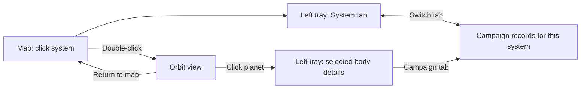
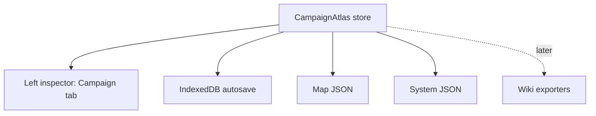

# Design Proposal: Campaign Atlas

**Status:** Draft updated with maintainer UX direction, 2026-09-16  
**Planned release:** v0.18.0 — Campaign Atlas and system inspection  
**Git workflow:** Maintainer handles all branches, staging, commits, and pull requests, per `CLAUDE.md`.  
**Baseline inspected:** As Above, So Below v0.17.5, commit [`912e6e2`](https://github.com/bartlebythecoder/traveller_magnus/commit/912e6e22faee2bcf825508ddb8690d1a98a2d9e7) (2026-09-11)  
**License:** GPL-3.0, matching the existing repository

## Summary

Campaign Atlas adds structured, persistent campaign records to As Above, So Below. A referee can attach people, places, businesses, organizations, jobs, events, items, and general notes to a star system without replacing the existing Referee Notes field.

The release also makes systems easier to explore. A shared left side panel, opened beside the **?** help button or by clicking a system, contains **System** and **Campaign** tabs. Double-clicking a system opens its orbit view. Selecting a planet shows its information in the same panel. This follows the maintainer's Stellaris-inspired direction: a map for navigation, an orbit view for exploring a system, and a persistent inspector for the current selection.

**Added requirement:** Records support attached images, especially portraits for people. Image support belongs in the first usable Campaign Atlas release, not an optional distant enhancement. The foundation can be split into text/persistence and image-support pull requests for review, but both are required for that release.

The first usable release includes:

- a docked left inspector with System and Campaign tabs;
- single-click system inspection, double-click orbit view, and persistent body selection;
- an explicit **Show orbit rings** checkbox, enabled by default;
- add, edit, list, search, and delete records for the current system;
- attach images to any record and choose a primary portrait or cover image;
- persist records in automatic browser saves, map JSON, and individual-system JSON;
- include record changes in undo and redo;
- expose the same Campaign tab from the upper-left launcher, World Details, and the System Viewer;
- keep all records referee-only and out of wiki exports until export visibility is implemented in a separate reviewable pull request.

This feature does not change Traveller rules, generation engines, system data, or anything in `rules/`.

## Why this fits the application

As Above, So Below already provides the hard parts of a Traveller atlas: sector navigation, detailed systems, an orrery, world images, surface views, editable systems, automatic browser persistence, map and system JSON, and Obsidian/HTML wiki exports.

What it does not yet provide is a structured home for what happens after a system is generated: contacts, settlements, shops, patrons, rumors, missions, factions, events, and referee-created lore. The existing `state.notes` field is valuable for unstructured notes, but one large text box cannot support browsing, filtering, relationships, or future player-safe export.

Campaign Atlas makes the generated universe usable as a persistent campaign workspace without turning the application into a general-purpose wiki editor.

## Current architecture relevant to this proposal

The design is based on the current repository rather than a framework rewrite:

- The application is a static single-page app using vanilla JavaScript, one HTML entry point, and no build step.
- `hexStates` in [`js/core.js`](js/core.js) is the authoritative in-memory store for generated map and system data.
- [`js/db_manager.js`](js/db_manager.js) mirrors application state to IndexedDB for automatic recovery between browser sessions.
- [`js/io_manager.js`](js/io_manager.js) saves map JSON, loads old and current save formats, and imports/exports a complete individual system.
- Referee Notes are stored as `state.notes`, edited by [`js/hex_editor.js`](js/hex_editor.js), included in referee wiki exports, and excluded from player exports.
- [`js/system_viewer.js`](js/system_viewer.js) normalizes five different engine-specific system shapes for display.
- The System Viewer already draws orbit rings and provides an **Orbit Lines** opacity slider. It supports body hover tooltips but has no persistent click selection. Extend these existing paths.
- [`js/canvas_input.js`](js/canvas_input.js) currently uses plain left drag for panning, Shift+click/drag for bulk selection, Ctrl+click for World Details, and held route shortcuts for route drawing. Route Manager also consumes map clicks while picking a route endpoint.
- Help already uses a left side panel. The new inspector must coordinate with it and preserve the existing map gestures.

One implementation detail drives the storage decision: several bulk generation paths replace a hex state with a new `{ type: ... }` object. Campaign content must not disappear because a referee regenerates or changes the rules engine for a system.

## Goals

1. Give referees structured records for campaign-specific people, places, businesses, organizations, jobs, events, items, and notes.
2. Keep campaign-authored content separate from rules-generated system data.
3. Preserve campaign records through generation, editing, save/load, browser restart, and individual-system transfer.
4. Follow the existing visual language and interaction patterns.
5. Create a data model that can later support cross-links, world-level anchors, global search, provenance, and player-facing exports.
6. Keep the first implementation small enough to review without touching generation rules.
7. Let referees recognize people by their portraits and illustrate places, businesses, items, and other records with images that travel with their saves.
8. Make system and planet information available through direct selection, with a consistent inspector across map and orbit views.

## Non-goals for the first pull request

- Markdown, HTML, or WYSIWYG editing
- automatic NPC, shop, patron, or job generation
- permanent body-, moon-, city-, or map-coordinate anchoring (pending the explicit scope question below; selecting a body for inspection is included)
- bidirectional wiki links
- non-image attachments, animated media, image generation, and advanced image editing
- multiplayer or cloud synchronization
- a campaign calendar, initiative tracker, or session log
- changes to CT, MgT2E, T5, RTT, or Architect of Worlds rules
- changing the existing Referee Notes field
- including Campaign Atlas content in either referee or player wiki exports

These are valid follow-up features, but combining them with the persistence foundation would make the first review unnecessarily risky.

## User experience

### Entry points

Add a **Campaign Atlas** launcher beside the **?** in the upper left. Use a real button with an accessible name, tooltip, visible focus, and expanded/collapsed state. It opens the left inspector at the current system; before any system has been inspected, show **Select a system on the map to begin**.

Also add a **Campaign** button in the World Details palette near **View World Image**, and in the System Viewer header beside **Edit System**. Both select the Campaign tab for that context's explicit `hexId`.

All entry points use one inspector and one selected-system context. Opening from the viewer must use the viewed system, not a different map selection or the hex beneath the center of the map.

Do not add another keyboard shortcut in the first pull request. The current shortcut set is already dense, and a shortcut is easy to add after the workflow proves useful.

### Map and orbit navigation

- **Single-click a populated system:** inspect that system and open the System tab. This is inspection focus, separate from the existing set of hexes selected for bulk mapping operations.
- **Double-click a populated system:** open that exact system in the existing orbit view, keeping its inspector available. If the system has only mainworld data and no expanded orbit data, show its available information and explain that orbit data has not been generated; do not silently generate or fabricate a system.
- **Drag the map:** continue panning. Use a small movement threshold to distinguish a click from a drag; a drag must not open the inspector on release.
- **Modified clicks and route picks:** preserve Shift selection, Ctrl World Details, route drawing, and Route Manager endpoint picking. A consumed route pick must not also inspect a system or open the orbit view.
- **Click a planet, moon, star, or belt in the orbit view:** retain that body as the inspection selection, mark it visibly, and show its available information in the System tab. Moving the mouse away must not dismiss the selected body's details.
- **Select a body in the inspector's body list:** select the same body in the orbit view. Provide keyboard-operable list buttons so inspection does not depend on hitting a small moving planet.
- **Return to map:** close the orbit view while keeping the system's inspector available. Provide a visible action as well as Escape, respecting any open record editor's unsaved changes.

Body selection is temporary UI state. Reuse `SystemViewer.normalizeSystem()` and the currently displayed bodies; do not invent a new rules interpretation. Clear body selection after regeneration or replacement instead of matching an old selection to a possibly unrelated new planet by name or orbit number.



### Shared left inspector

Use a docked, collapsible side panel in the application's existing visual style, approximately 380–420 px wide on desktop. The inspector replaces the proposed draggable Campaign palette as the primary home of this feature.

- Keep system name and hex identifier in the header, with a close control and System/Campaign tabs below.
- Reserve space beside the orbit canvas so the selected system is centered in the visible viewing area. Resize the canvas when the tray opens, closes, or the viewport changes; pointer coordinates must use the canvas's actual bounds.
- Keep content vertically scrollable at 720 px viewport height, with reachable navigation and record actions. Clamp width on narrow screens and allow the tray to collapse to recover viewing space.
- Coordinate with the existing Help panel so opening either left panel does not leave two panels stacked over each other. Protect record drafts before switching panels.
- Show an empty state for unselected or unavailable systems. After map load, undo/redo, system edits, or regeneration, refresh the context and clear any stale body selection.
- Keep the current system unmistakable while editing. Switching tabs may retain the draft, but changing systems, closing the editor, loading a map, or leaving a view must not silently discard it or attach it to the new system.

The **System** tab shows the available mainworld information, including name, UWP, trade codes, allegiance, travel zone, bases and Referee Notes, followed by a star/body list when expanded data exists. Use collapsible groups for detailed physical, stellar, and socioeconomic information. A selected body gets a breadcrumb back to the system and its available details. Keep access to the existing World Details, Edit System, world image, and surface views where supported. Missing data should be described as unavailable, not calculated speculatively.

The **Campaign** tab contains:

- system name and hex identifier;
- search input;
- type filter;
- compact record count by type;
- record list showing name, type, summary, and tags;
- **Add Record**, **Edit**, and **Delete** actions;
- an empty state explaining what can be added.

Selecting a record opens its details and editor within the tray, with a clear return to the record list. The initial form contains:

| Field | Requirement |
|---|---|
| Type | Required; one of the supported record types |
| Name | Required; 1–120 characters |
| Summary | Optional short description; 0–300 characters |
| Details | Optional plain text |
| Location label | Optional free text such as `Regina Down Starport / Startown` |
| Tags | Optional comma-separated labels, normalized and deduplicated |
| Images | Optional gallery with one primary portrait/cover, captions, alt text, and image credits |

The first version deliberately uses plain text for written content, alongside image attachments. Any rendered Markdown or wiki-link syntax would require a sanitization and unresolved-link policy that should be reviewed separately.

### How records belong to a system

**Add Record** captures the inspector's current `hexId` in `anchor.hexId`. The editor shows **System: Regina (1-C-1910)**, for example, so ownership is visible. Campaign lists always filter by that system, regardless of whether its orbit view is open or a planet is selected.

The baseline remains system ownership plus a free-text location, such as **Regina / Downport / Startown**. Selecting a planet inspects its generated data; it does not silently change the ownership of a record. Permanent planet attachments require the body-anchor resolver described later and remain the one outstanding scope question for this revision.

### Orbit ring controls

The existing viewer already renders orbit rings. Add a clearly labeled **Show orbit rings** checkbox, checked on first use, and retain the opacity slider as a separate strength control. Turning rings off and back on should restore the chosen strength; the enabled default must be visibly useful. Keep moon visibility and habitable-zone shading separate from orbit visibility.

The checkbox controls orbital guide lines, including supported companion-star and moon orbit guides, rather than hiding bodies, physical planetary rings, or planetoid belts. It changes display only. Ensure the viewer's controls wrap or move into a compact controls area when the left inspector is open; the current long header must not push essential actions off-screen.

### Images and portraits

Every record type supports multiple images. For people, the primary image is labeled **Portrait**; other types use **Cover image**. Show its thumbnail beside the record name in lists and a larger image in the detail panel. Records without an image use a neutral type icon.

- Provide an **Add Images** file picker and drag-and-drop area; keep the picker available for keyboard users.
- Support JPEG, PNG, and WebP initially. Reject SVG, animated images, unsupported formats, and files that fail actual image decoding rather than relying on the filename extension.
- Allow viewing full-size, choosing the primary image, reordering the gallery, editing captions/alt text/credits, replacing an image, and removing an attachment.
- Keep the full stored image visible in detail view. Thumbnail fitting must not destructively crop the image; a crop editor can come later.
- Default the first attachment to primary. Removing it selects the next image, or clears the primary reference if none remain.
- Cancellation leaves the existing record and its images unchanged. Failed uploads show an actionable error and must not leave broken references.

Maintainer-approved initial limits (2026-09-16): 10 images per record, 10 MiB and 20 megapixels per incoming image, a 2048-pixel longest edge for the stored display image, and a 256-pixel thumbnail. Show users that large images are resized and that original files are not retained. Re-encode decoded pixels to remove source metadata, including location metadata. Preserve transparency where present. Enforce a 50 MiB total **serialized image payload** budget per map for the initial JSON-based implementation, including thumbnails; report remaining capacity before rejecting an upload. These are product limits, not claims about browser capacity.

### Record types

Use a fixed list in the first version so filters and future exports remain predictable:

| Type | Intended use |
|---|---|
| `person` | NPC, patron, contact, rival, noble, crew member |
| `place` | City, starport, district, base, wilderness site, room |
| `business` | Shop, bar, shipyard, broker, service provider |
| `organization` | Government, corporation, gang, military unit, religion |
| `job` | Mission, freight opportunity, bounty, rumor, patron request |
| `event` | Festival, conflict, disaster, arrival, political or historical event |
| `item` | Ship, artifact, cargo, document, equipment |
| `note` | Material that does not fit another type |

Display labels may be pluralized or localized later, but persisted values should remain stable lowercase identifiers.

## Data ownership and storage

### Decision: a separate campaign store

Create a top-level in-memory store rather than adding records to each generated `hexState`:

```js
window.campaignAtlas = {
  schemaVersion: 1,
  records: {},
  assets: {} // Metadata only; binary image payloads are stored separately.
};
```

This separation is intentional:

- bulk generation can replace `hexStates` entries;
- campaign records are user-authored, not Traveller rules output;
- future records may link across systems;
- a global index should not need to traverse five different engine-specific system shapes;
- system regeneration must never silently erase campaign work.



### Record schema

```js
{
  id: "cr_01J...",
  type: "business",
  name: "The Broken Spanner",
  summary: "A spacer bar beneath the old docking tower.",
  details: "Owner: Mara Venn\nKnown for cheap Vilani beer...",
  tags: ["bar", "information", "spacers"],

  anchor: {
    hexId: "1-C-1910",
    kind: "system",
    locationLabel: "Regina Down Starport / Startown"
  },

  visibility: "referee",
  provenance: {
    kind: "campaign",
    citation: ""
  },

  links: [],
  images: [], // [{ assetId, caption, altText, credit, sourceUrl }]
  primaryImageId: null, // Must reference an asset attached in images[].
  createdAt: "2026-09-16T00:00:00.000Z",
  updatedAt: "2026-09-16T00:00:00.000Z"
}
```

Notes on reserved fields:

- `visibility` is stored now but fixed to `referee` in the initial UI. This makes the safe default explicit and avoids a migration when player exports are added.
- `provenance.kind` defaults to `campaign`. A later release may expose user-selected `published` and `generated` values, but the application must never infer that user text is canonical.
- `links` is reserved for relationships between records. It remains empty in the first version.
- `anchor.kind` is `system` in the first version. The structure allows a later body anchor without changing every record.

Use `crypto.randomUUID()` when available, with an application-local fallback. IDs must not be derived from names because names are editable and need not be unique.

### Image asset model

Each entry in `campaignAtlas.assets` describes one immutable asset: `id`, `mimeType`, `width`, `height`, `byteLength`, thumbnail dimensions/size, and `createdAt`. Its display-image and thumbnail bytes live separately as Blobs; records reference them by `assetId`. Do not put base64 images in `hexStates`, record text, or undo snapshots. Browser object URLs are temporary display handles, never saved references, and are revoked when no longer displayed.

Replacing an image creates a new asset ID. Captions, alt text, and credits belong to the attachment so that later reuse does not share private annotations accidentally. Source URLs are optional attribution text, not remotely loaded images. Images are supplied locally by the referee; automatic fetching and hotlinking are outside the first release.

## Persistence and lifecycle

### Automatic browser save

Store `campaignAtlas` in the existing IndexedDB `appState` object store. This does not require a database version change because `appState` already accepts named values.

Add `saveCampaignAtlas()` to `db_manager.js`, call it from the existing debounced full-sync path, and restore it during `loadFromDB()`.

Use namespaced keys such as `campaignAsset:<id>` in the same `appState` store for image/thumbnail Blobs. Store new asset bytes and committed record references in one transaction. Restore the campaign metadata without eagerly decoding every image; load thumbnails and full images on demand. Report quota or transaction failures visibly, retain the editor draft, and never claim an attachment was saved before the transaction commits. Because the existing `loadFromDB()` cursor reads all app-state values, explicitly exclude asset payloads from that bulk read and expose targeted asset reads. Do not route image writes through the existing fire-and-forget success assumptions.

### Map JSON

Add `campaignAtlas` as a top-level property of the map save object. For chunked saves, include it in Part 1 with the other shared metadata.

Also serialize referenced images and thumbnails once per asset into a top-level `campaignAssets` dictionary with explicit MIME types and base64 bytes. This makes map JSON self-contained: importing on another computer restores the images without access to the original files. The 50 MiB serialized image budget keeps this payload bounded; multipart saves carry it in Part 1 and must subtract its measured size from that part's hex-data allowance. Partition remaining hex data by encoded size, not just hex count. A save that cannot fit or load must fail clearly rather than omit images.

On load:

- missing `campaignAtlas` means an older save and becomes an empty v1 store;
- an unsupported future schema version must produce a clear error rather than discarding records;
- loading a map replaces the current campaign store, matching how the map itself is replaced.

Decode and validate the complete campaign payload, sizes, MIME types, and asset references before replacing active data. Missing assets are import errors, not permission to silently discard attachments. Saves with no image fields normalize to empty galleries. Browser recovery is not a backup: continue encouraging explicit JSON downloads.

### Individual-system JSON

Include only records whose `anchor.hexId` matches the exported system.

Include only the image assets referenced by those records. Map and system JSON are full referee backups, including private images; label them accordingly and do not present them as player handouts.

When importing the system into another hex:

- deep-clone the records;
- rewrite each matching `anchor.hexId` to the target hex;
- preserve record IDs unless they collide with existing IDs;
- on collision, generate a new ID and rewrite any local links in the imported record set;
- remap colliding image asset IDs and their attachment/primary-image references without replacing existing assets;
- do not overwrite unrelated campaign records already attached to the target hex without an explicit confirmation.

When target records exist, present **Merge records** or **Import system only**, with Merge records as the suggested choice. When no target records exist, import the system and its campaign records normally without another checkbox. The maintainer expressed no preference, so this is the implementation default. Replacing existing campaign records is deferred until there is a clear conflict-resolution screen.

### Undo and redo

Campaign mutations must call `saveHistoryState()` before changing data. Extend history snapshots and the restore path in `keyboard_shortcuts.js` to carry `campaignAtlas` alongside routes and `hexStates`.

Required undoable actions:

- Add Campaign Record
- Edit Campaign Record
- Delete Campaign Record
- Attach, Remove, Replace, Reorder, and Set Primary Image

History snapshots carry attachment references and asset metadata, not binary copies. Keep immutable asset bytes reachable from active records or either history stack so undo can restore a deleted portrait. Garbage-collect only assets unreachable from all three; do not erase bytes immediately when an attachment or record is deleted. Export only assets reachable from active records, not historical attachments. Clear Canvas must remove namespaced campaign asset bytes as well as records and history.

### Clear Canvas

Clear Canvas must clear the Campaign Atlas after the existing destructive confirmation. The confirmation text should mention campaign records so the scope is not surprising.

### Generation and system editing

Generation code does not read or write the Campaign Atlas. Regenerating, editing, importing TravellerMap data, or switching the active rules engine therefore leaves campaign records untouched.

If a system becomes empty, its records remain stored but are not shown from the map. A future global index can expose these as orphaned records. Silent deletion is not acceptable.

## Body and location anchoring

World-level attachment remains deferred in the baseline, pending the maintainer's answer about permanent planet links. Body selection and inspection are included in the first release and do not require persistent body anchors.

The five generation engines do not expose one durable body identifier through the normalized viewer model. Current export code resolves raw bodies primarily by name and then by engine-specific orbit data. Names can be missing or edited, while orbit values are not unique in every system. Adding apparently precise body links in the first version would create links that can silently point at the wrong world after regeneration.

A follow-up body-anchor design should introduce a shared resolver and store a compound reference with fallbacks, for example:

```js
{
  kind: "body",
  hexId: "1-C-1910",
  bodyRef: {
    bodyKind: "world",
    name: "Regina",
    parentStarIndex: 0,
    orbitValue: 3,
    ordinal: 2
  },
  locationLabel: "Regina Down Starport / Startown"
}
```

If resolution fails, the UI should show **Unresolved location** and keep the record. It must never delete the record or silently reattach it.

## Player visibility and wiki export

The existing player export is carefully designed to prevent referee-only data from leaking. Campaign Atlas should preserve that standard.

For the first pull request:

- Campaign Atlas records are always `referee` visibility;
- neither Obsidian nor HTML export includes them;
- no record text appears in player exports, filenames, hidden metadata, image labels, search indexes, or counts.
- no Campaign Atlas image, thumbnail, caption, credit, or source URL is included in either wiki format in this first release.

A separate export pull request can add:

- `public`, `discovered`, and `referee` visibility;
- an explicit discovered toggle;
- referee export pages for campaign records;
- player export filtering;
- cross-links and backlinks;
- tests that search every produced file for known referee-only sentinel text.

In that later export release, an attachment inherits its record's visibility and may be marked more restrictive, never less. Copy only eligible image bytes into the exported archive using asset-ID-based filenames and relative links for HTML/Obsidian. Never bundle the entire asset store and hide private images only through the UI. Build the allowed asset set from visible attachments, then emit files; test the archive's binary assets as well as text. Captions and credits follow the same visibility rules. Publishing an image already disclosed to players cannot revoke copies they have downloaded.

Keeping export work separate makes a privacy-sensitive review much easier.

## Proposed code changes for the first pull request

| File | Change |
|---|---|
| `js/campaign_atlas.js` | New namespaced model and UI controller; CRUD, validation, filtering, rendering, serialization helpers |
| `js/campaign_assets.js` | Proposed focused image helper: validation, resizing, thumbnails, Blob lifecycle, portable serialization; check existing helpers before adding |
| `js/system_inspector.js` | Proposed shared left-panel controller for system context, System/Campaign tabs, and body inspection; reuse existing display helpers before creating a module |
| `hex_map.html` | Load the new scripts; add the upper-left launcher, inspector markup, and Campaign entry button in World Details |
| `style.css` | Namespaced inspector and Campaign styles; responsive orbit-view layout and controls |
| `js/canvas_input.js` | Distinguish inspection clicks from panning; double-click the explicit system; preserve modified gestures and route picking |
| `js/system_viewer.js` | Connect the inspector, persistent body selection, ring visibility checkbox, canvas resizing, and Campaign entry point |
| `js/ui_menus.js` | Coordinate Help and inspector visibility without discarding editor drafts |
| `js/core.js` | Initialize the campaign store and include it in history snapshots |
| `js/keyboard_shortcuts.js` | Restore campaign state during undo/redo; coordinate Escape with inspector and record drafts |
| `js/db_manager.js` | Load/autosave campaign state; targeted Blob reads, transactional image commits, quota errors, and asset cleanup |
| `js/io_manager.js` | Self-contained map/system JSON with image bytes, size-aware multipart saves, import validation, and Clear Canvas behavior |
| `js/input_init.js` | Initialize the shared inspector and `CampaignAtlas.setup()` |
| `README.md` | Add the feature and basic usage |
| `changelog.md` | Document the v0.18.0 feature and navigation changes; follow the version procedure for core, README, splash, and help text |

Do not edit `rules/` or generation engine files.

### Public module interface

Keep the module small and explicit:

```js
window.CampaignAtlas = {
  setup,
  openForHex,
  close,
  addRecord,
  updateRecord,
  deleteRecord,
  recordsForHex,
  exportForHex,
  importForHex,
  emptyStore,
  normalizeStore
};
```

UI code should call model methods rather than mutate `window.campaignAtlas.records` directly.

## Safety, validation, and accessibility

- Render user text with `textContent`, never `innerHTML`.
- Keep the first version plain text to avoid script injection in the live app or exported files.
- Trim names and tags, reject blank names, and cap field lengths to prevent accidental multi-megabyte records.
- Confirm deletion with the record name.
- Buttons need visible focus states and text or `aria-label` values.
- The inspector must remain usable at 720 px viewport height and must scroll vertically rather than extend off-screen.
- Search should be case-insensitive and match name, summary, details, location label, and tags.
- Closing an editor with unsaved changes should confirm before discarding.

## Compatibility

Backward compatibility is additive:

- old map JSON loads with an empty Campaign Atlas;
- new map JSON remains readable by older versions because unknown top-level fields are ignored;
- old individual-system JSON imports with no campaign records;
- records without image fields gain empty galleries and no primary image;
- campaign records do not change generated system schemas;
- IndexedDB does not require an object-store migration;
- no external dependencies or build tools are introduced.

Forward compatibility requires checking `schemaVersion`. The initial normalizer may accept only version 1; unknown versions should halt import with a clear message and leave current data unchanged.

Older application versions may open the map but will not understand or preserve Campaign Atlas images or records when saving again. Warn users to keep the original backup before opening a campaign-enabled save in an older version. If text-only foundation code ships separately, bump the campaign schema version when image support ships rather than treating an already-released schema as unchanged.

## Test plan

The repository has no automated test command, so the first pull request should include a documented browser test matrix. Pure model functions should also be written so they can later be exercised by a lightweight test harness without the DOM.

### Core record behavior

- Create each record type.
- Edit all fields and verify tag normalization.
- Reject a blank name.
- Delete a record and cancel deletion.
- Search across every searchable field.
- Filter by type and clear the filter.
- Open the same system from World Details and System Viewer.

### System inspection and navigation

- Single-click a system to inspect it without changing the bulk selection set; double-click opens that exact system in the orbit view.
- Pan the map and orbit view without selecting the release target. Verify Shift selection, Ctrl World Details, route drawing, and endpoint picking retain their behavior.
- Select planets, moons, stars, and belts from the orbit canvas and body list; verify persistent selection, matching details, and keyboard access.
- Toggle Show orbit rings and vary strength; verify bodies, physical rings, belts, moon visibility, and HZ controls remain independent.
- Open and collapse the tray in both views, resize the viewport, and verify canvas alignment, pointer targeting, and reachable controls at 720 px height.
- Open Help, return to the inspector, return to the map, and use Escape with both clean and dirty record editors.
- Switch systems while a record draft exists; verify the draft is preserved or explicitly discarded, and never saved to the new system accidentally.
- Inspect a system with mainworld data only and verify useful information plus a clear unavailable-orbit state.
- Edit, regenerate, undo, redo, or load a map while inspecting; verify fresh system details and no stale body selection.

### Persistence

- Reload the browser and verify IndexedDB restoration.
- Save and reload a single-file map JSON.
- Save and reload a chunked map JSON.
- Load a pre-feature map JSON and verify an empty, usable Campaign Atlas.
- Export a system, import it into a different hex, and verify anchor rewriting.
- Import into a target with existing records and verify merge behavior.

### Images and portraits

- Attach JPEG, PNG, and WebP images to a person and a non-person record; select the portrait/cover and reorder images.
- Check transparent images, phone-photo orientation, long captions, alt text, and neutral placeholders.
- Reject invalid, oversized, unsupported, animated, and misleadingly named files without changing the record.
- Verify image bytes and primary selection survive browser restart, cross-browser/device JSON transfer, multipart saves, system import into another hex, and regeneration.
- Undo/redo image attachment, replacement, primary selection, removal, and record deletion; verify pixels are recoverable, not just metadata.
- Simulate unavailable/full IndexedDB, interrupted commits, duplicate IDs, and missing payloads. Show failure without erasing current records or the editor draft.
- Confirm thumbnail loading does not decode all full-size images or copy their bytes into every undo snapshot.
- Confirm a replaced/deleted image is eventually cleaned up only after all active and history references disappear.

### Lifecycle protection

- Add records, regenerate the system with each supported engine, and verify records survive.
- Edit the system and verify records survive.
- Turn the hex empty, undo, and verify records return with the system.
- Clear Canvas and verify campaign records are removed only after confirmation.

### Undo and redo

- Undo and redo add, edit, and delete.
- Undo an unrelated cartography change after editing a record and verify both states restore correctly.
- Verify automatic persistence after undo and redo.

### Export privacy

- Put a unique sentinel phrase in a campaign record.
- Export referee and player Obsidian wikis.
- Export referee and player HTML wikis.
- Confirm the sentinel does not occur anywhere in any archive during the first release.
- Add a distinctive private portrait and verify that neither its full image nor thumbnail is present in any wiki archive; checking text alone is insufficient.

## Delivery plan

### Pull request 0: design review

Review this document and resolve permanent planet-link scope. Git and any design-only pull request are handled by the maintainer; they are not an agent permission gate or required implementation prerequisite.

### Pull request 1: Campaign Atlas foundation

- shared left inspector with System and Campaign tabs;
- single-click system inspection and double-click orbit view;
- persistent body selection and explicit orbit ring visibility;
- system-scoped CRUD and search;
- separate campaign store;
- autosave, map JSON, and system JSON;
- undo/redo;
- referee-only data;
- no wiki export changes.
- image galleries on all record types, primary portraits/covers, and self-contained image persistence/transfer.

Implement in three reviewable steps: **1a: inspector and navigation**, **1b: records and persistence**, and **1c: images and portraits**. All three are part of the requested first usable v0.18.0 release. Image support precedes relationships, permanent body anchoring, and wiki exports unless the maintainer explicitly revises that scope.

### Pull request 2: relationships and locations

- body-anchor resolver;
- record-to-record links and backlinks;
- place hierarchy;
- global Campaign Atlas index and orphaned-record view.

### Pull request 3: wiki export and visibility

- provenance controls;
- public/discovered/referee visibility;
- Obsidian and HTML output;
- player-safe filtering and leak tests.

### Pull request 4: optional generation helpers

- opt-in generated patrons, jobs, rumors, or businesses;
- generated records visibly marked as generated;
- no overwriting of campaign-authored records.

## Acceptance criteria for the first implementation

The foundation is complete when:

1. A referee can manage structured records in the shared left inspector, reachable from the upper-left launcher, World Details, and the System Viewer.
2. Records survive browser reload, map JSON round-trip, individual-system transfer, and system regeneration.
3. Add, edit, and delete participate in the existing undo/redo workflow.
4. Old saves load without migration work from the user.
5. Campaign data is absent from every wiki export.
6. No generation engine or `rules/` file changes.
7. The app still runs by opening `hex_map.html` directly with no build step.
8. A referee can attach multiple images to any record and choose a person's primary portrait.
9. Portraits and galleries survive the same save, transfer, undo/redo, and regeneration workflows as record text.
10. Private image bytes and metadata never appear in wiki exports, and storage failures never silently lose attachments.
11. Single-clicking a system opens its information tray; double-clicking opens that system's available orbit view without interfering with existing mapping gestures.
12. Planets and other supported bodies can be selected persistently from both the orbit view and an accessible body list, showing their available information in the tray.
13. Orbit rings have an explicit checkbox, enabled by default, and the tray and viewer controls remain usable together at 720 px viewport height.
14. Switching context cannot silently discard a record draft or save it to a different system.

## Decisions and remaining scope question

- **Approved:** proposed image limits and resized-image storage, including the 50 MiB serialized image budget.
- **Approved direction:** a new version; planned number v0.18.0.
- **Approved direction:** left panel beside Help, system information on click, orbit view on double-click, visible orbit rings, planet selection, and campaign entry in the left panel.
- **Implementation default:** Campaign Atlas name; import records normally into an empty destination, offer Merge records / Import system only when target records exist; preserve records when a hex becomes empty.
- **Maintainer-owned:** all Git and pull-request choices.
- **Outstanding:** must v0.18.0 attach campaign records permanently to individual planets, or is system ownership plus a location label sufficient while planet selection displays details? The baseline is the latter. Do not implement permanent body links until that scope is settled.

## Recommendation

Start implementation with the shared inspector and navigation, then add campaign records, persistence, and image support into that same panel. This establishes one system context for exploration and campaign work. Keep wiki export and permanent body anchors outside the baseline release; settle the outstanding planet-link question before implementing those links.
